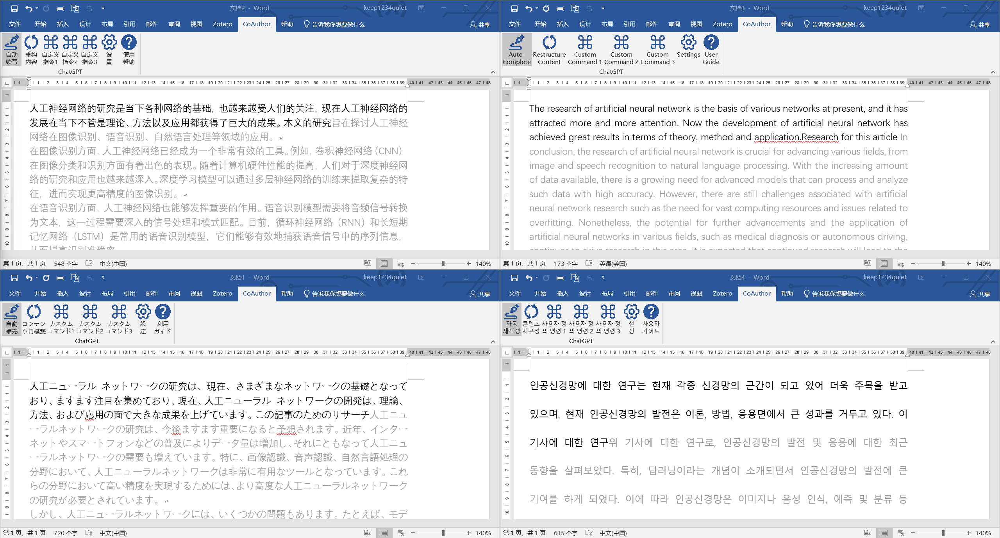
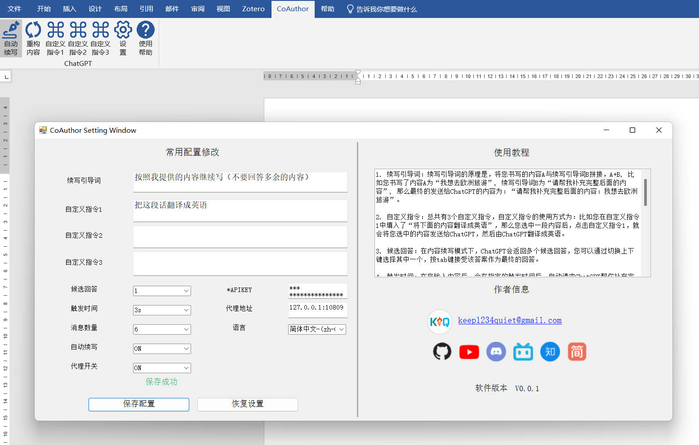

# CoAuthor: 你的AI写作助手

[[English](../english/readme.md) | [简体中文](../chinese/README.md)]

# 1. 介绍
CoAuthor 是一款将GPT-3.5-turbo开放API接口集成进word的插件，它可以在你写作时进行提示，你可以通过配置文件修改候选答案的数量，这样每次进行提示后可以通过上下键切换提示内容



# 2. 插件配置

> a. 安装好插件后，需要填写OpenAI官网申请的APIKey,否则无法使用；
>  APIKey获取位置: [https://platform.openai.com/account/api-keys](https://platform.openai.com/account/api-keys)
 

> b. 如果出现网络问题，可能还需要配置代理才行，代理目前仅支持http代理；
 
> c. 插件首次提示需要输入10个以上字符才会触发，之后每次触发需要输入6个以上字符即可触发；


> d. 还有其他更多功能等你去探索...




# 3. 使用说明
> a. 出现内容提示后，按上下键可以切换提示内容，按Tab键接受，按Esc键取消;
> b. 


# 4. 包依赖

如果你需要自己编译出一个安装文件，可以自行下载工程文件进行编译，但需要安装下面的包依赖：

```
NuGet Install-Package Newtonsoft.Json
NuGet Install-Package Serilog
NuGet Install-Package Serilog.Sinks.File
```

# 5. 其他

1. 后面是我后续会发布使用说明及更新的平台，有需要的话可以关注一下，频道内暂时没有内容；
2. 有时候会触发一些Bug,请记得及时保存文件，以免内容丢失；

