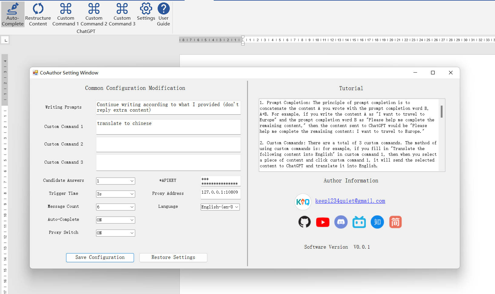

# CoAuthor: Your AI pair writer

[[English](../english/readme.md) | [简体中文](../chinese/README.md)]

# 1.Introduce
CoAuthor is a plug-in that integrates the GPT-3.5-turbo open API interface into word. It can prompt you when you write. You can modify the number of candidate answers through the configuration file, so that you can use the up and down keys to switch after each prompt Prompt content


# 2. Plugin configuration

> a. After installing the plug-in, you need to fill in the APIKey applied on the OpenAI official website, otherwise it cannot be used;
> APIKey acquisition location: [https://platform.openai.com/account/api-keys](https://platform.openai.com/account/api-keys)
 

> b. If there is a network problem, you may need to configure a proxy. Currently, the proxy only supports http proxy;
 
> c. The plug-in prompts for the first time that you need to enter more than 10 characters to trigger, and then each trigger needs to enter more than 6 characters to trigger;

> d. There are many more features waiting for you to explore...



# 3. Instructions for use
> a. After the content prompt appears, press the up and down keys to switch the prompt content, press the Tab key to accept, and press the Esc key to cancel;
> b.


# 4. Package dependencies

If you need to compile an installation file yourself, you can download the project file and compile it yourself, but you need to install the following package dependencies:

```
NuGet Install-Package Newtonsoft.Json
NuGet Install-Package Serilog
NuGet Install-Package Serilog.Sinks.File
```

# 5. Other

1. The following is the platform where I will release instructions and updates in the future. If you need it, you can pay attention to it. There is no content in the channel for the time being;
2. Sometimes some bugs will be triggered, please remember to save the file in time to avoid loss of content;